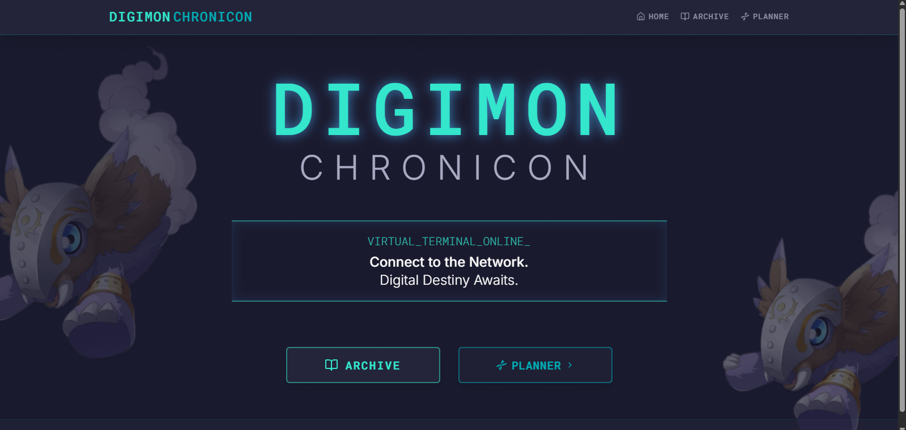
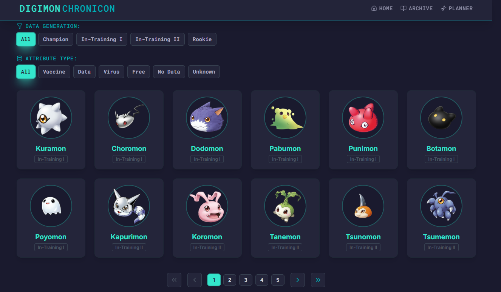
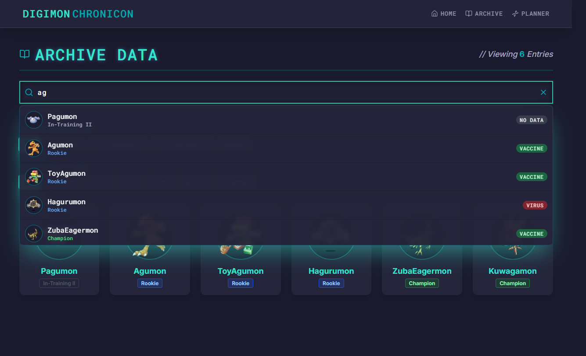
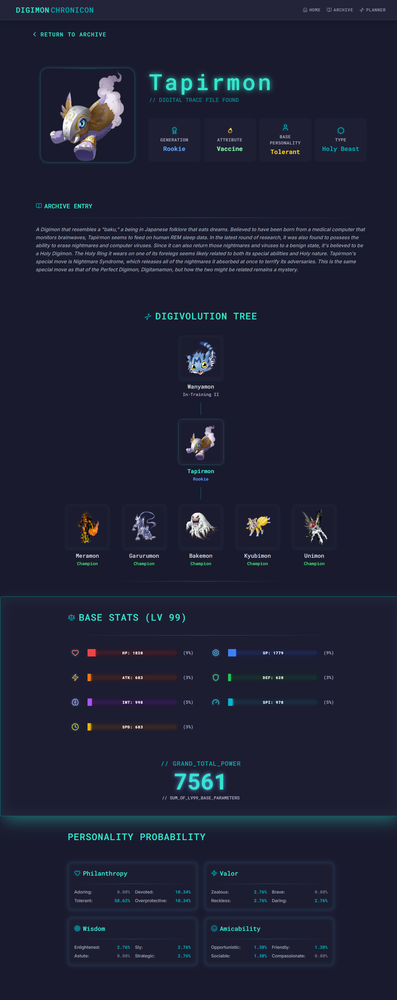
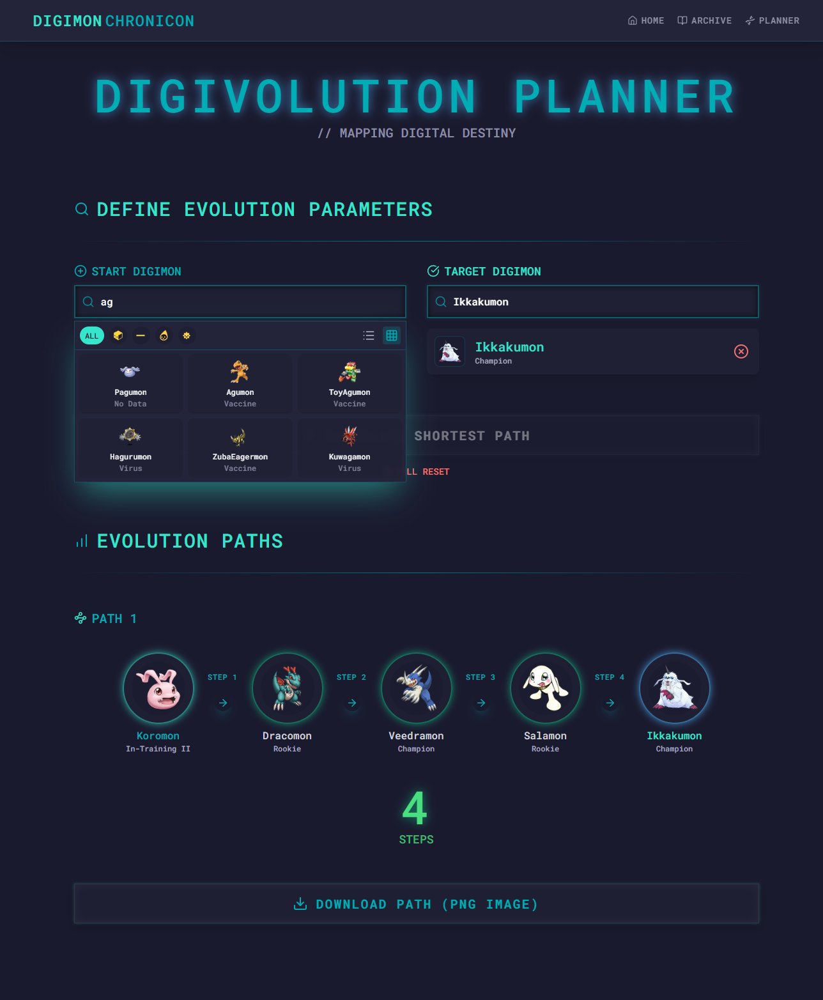

# 👾 Digimon Chronicon: Digital Archive Console

**Digimon Chronicon** is a web application built to serve as a digital archive or "Digivice Console" for browsing detailed Digimon data. It merges the functionality of a data archive with the visuals of a futuristic, cyberpunk-inspired terminal interface, offering an immersive experience for enthusiasts.

---

## 🧭 Table of Contents

- [✨ Project Overview & Core Features](#-project-overview--core-features)
- [🛠️ Technology Stack](#-technology-stack)
- [🚀 Getting Started](#-getting-started)
- [🎨 Digital Archive Console UI](#-digital-archive-console-ui)

---

## ✨ Project Overview & Core Features

The primary goal of this project is to deliver a high-fidelity user experience that celebrates the Digimon aesthetic through advanced design implementation in Tailwind CSS.

---

## 🛠️ Technology Stack

| Category | Technology | Purpose |
| :--- | :--- | :--- |
| **Frontend** | **React** | Core library for building the dynamic, component-based user interface. |
| **Styling** | **Tailwind CSS** | Utility-first framework critical for implementing the complex, high-fidelity neon and panel effects with custom configurations. |
| **Build Tooling**| **Vite** | Used for rapid development, hot module reloading, and efficient bundling. |
| **Icons** | **Lucide Icons** | Clean, modern vector icons used to represent statistics and data fields. |

---

## 🚀 Getting Started

To run the Digimon Chronicon digital archive locally, follow these steps:

### Prerequisites

You need a recent version of **Node.js** and **npm** installed.

### Installation

1.  **Clone the repository:**
    ```bash
    git clone [https://github.com/ararune/digimon-chronicon](https://github.com/ararune/digimon-chronicon)
    cd digimon-chronicon
    ```

2.  **Install project dependencies:**
    ```bash
    npm install
    # or yarn install
    ```

3.  **Start the development server:**
    ```bash
    npm run dev
    # or yarn dev
    ```

The application will be accessible in your browser at `http://localhost:5173`.

---

## 🎨 Digital Archive Console UI

The interface uses a custom cyberpunk aesthetic implemented with Tailwind CSS, featuring neon glows, transparent panels, and terminal effects for an immersive experience.

<div align="center" style="display: flex; flex-wrap: wrap; justify-content: center; gap: 25px; margin: 40px 0;">
    
  <a href="#Digital Archive Console UI" style="flex: 1 1 250px; max-width: 48%; min-width: 250px; text-decoration: none;">
    
    <p style="text-align: center; margin-top: 10px; font-weight: 600; color: #EEEEEE;">
        Landing / Home Screen
    </p>
  </a>

  <a href="#Digital Archive Console UI" style="flex: 1 1 250px; max-width: 48%; min-width: 250px; text-decoration: none;">
    
    <p style="text-align: center; margin-top: 10px; font-weight: 600; color: #EEEEEE;">
        Archive List View (Initial)
    </p>
  </a>

  <a href="#Digital Archive Console UI" style="flex: 1 1 250px; max-width: 48%; min-width: 250px; text-decoration: none;">
    
    <p style="text-align: center; margin-top: 10px; font-weight: 600; color: #EEEEEE;">
        Archive List View (Scroll)
    </p>
  </a>

  <a href="#Digital Archive Console UI" style="flex: 1 1 250px; max-width: 48%; min-width: 250px; text-decoration: none;">
    
    <p style="text-align: center; margin-top: 10px; font-weight: 600; color: #EEEEEE;">
        Digimon Detail View
    </p>
  </a>

  <a href="#Digital Archive Console UI" style="flex: 1 1 250px; max-width: 48%; min-width: 250px; text-decoration: none;">
    
    <p style="text-align: center; margin-top: 10px; font-weight: 600; color: #EEEEEE;">
        Digivolution Planner
    </p>
  </a>
  
</div>